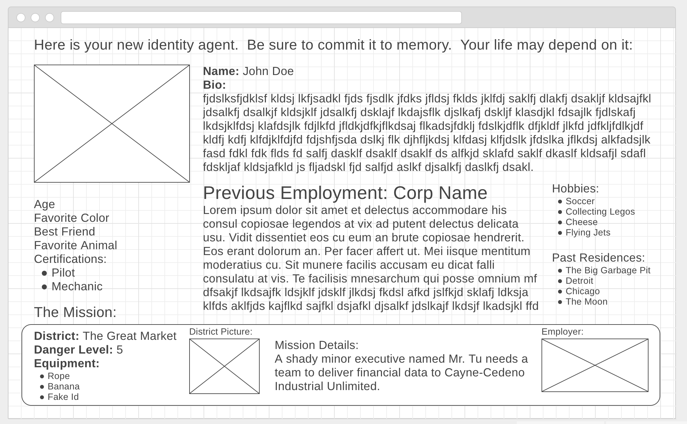

INTRO

Hello, my name is Tim.  I am a student at the web development course at Galvanize in Boulder. This is a silly little game I made for my Q1 project.

WHAT IS THIS?

Just a fun little memorization game.

It is set in a future were spies are hired to infiltrate corporations to do important espionage missions. The page should have a cyberpunk aesthetic.

When the page loads, you will be given an identity you need to memorize. Read your new identity carefully and try to memorize important details.  

When done, click the PROCEED button at the bottom.

Now answer 5 questions about what you read before.

Once done, submit at the bottom to see if you got them right.

Don't worry, if you fail, you die!

Have fun!
